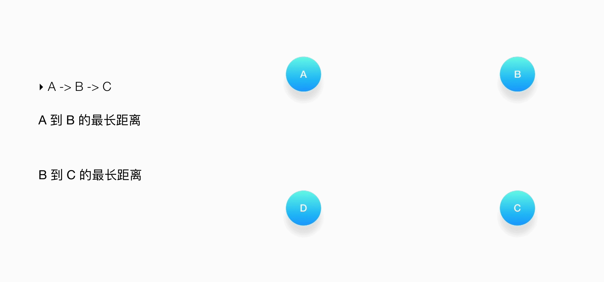
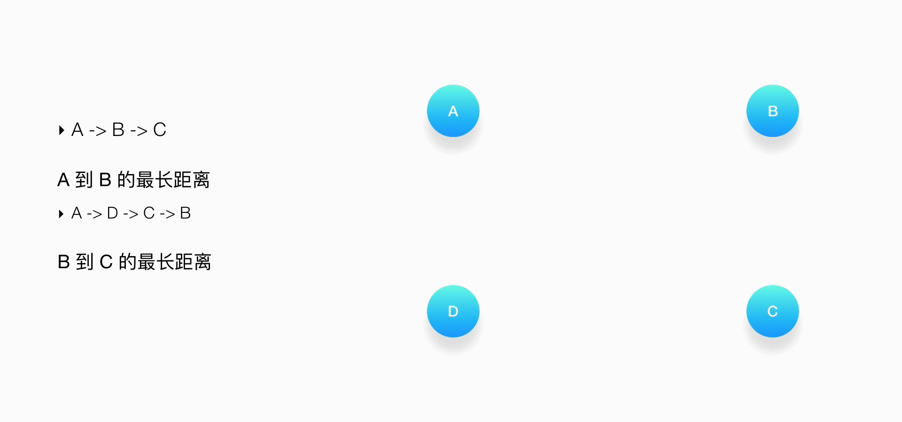
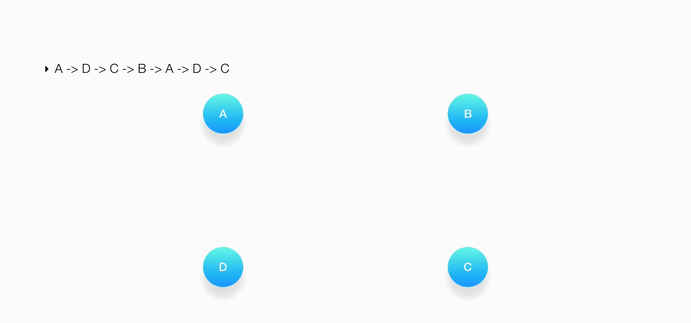
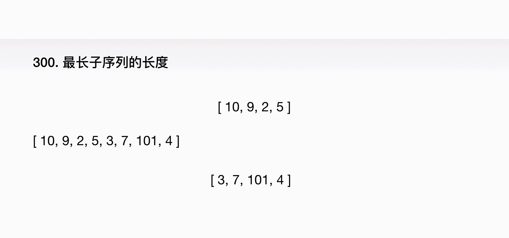

## 动态规划  

### 判断动态规划
Wikipedia 定义：它既是一种数学优化的方法，同时也是编程的方法。  

1. 是数学优化的方法————最优子结构  
动态规划是数学优化的方法指，动态规划要解决的都是问题的最优解。而一个问题的最优解是由它的各个子问题的最优解决定的。  
由此引出动态规划的第一个重要的属性：最优子结构（Optimal Substructure)。  
一般由最优子结构，推导出一个状态转移方程 f(n)，就能很快写出问题的递归实现方法。  
  

2. 是编程的方法————重叠子问题
动态规划是编程的方法指，可以借助编程的技巧去保证每个重叠的子问题只会被求解一次。  
引出了动态规划的第二个重要的属性：重叠子问题（Overlapping Sub-problems）。  
  
下面通过几个小例题来判断其方法是否符合动态规划。  

**举例1**：斐波那契数列问题  
解法：为了求出第 5 个斐波那契数，得先求出第 4 个和第 3 个数，但是在求第 4 个数的时候，又得重复计算一次第 3 个数，同样，对于第 2 个数的计算也出现了重复。  

因此，判断一个问题能不能称得上是动态规划的问题，需要看它是否同时满足这两个重要的属性：最优子结构（Optimal Substructure）和重叠子问题（Overlapping Sub-problems）

**举例2**：给定如下的一个有向图，求出从顶点 A 到 C 的最长的路径。要求路径中的点只能出现一次。  
  
按照题目的要求，可以看到，从 A 通往 C 有两条最长的路径：A -> B -> C 和 A -> D -> C。  
对于A -> B -> C, A 到 B 的最长距离是：A -> D -> C -> B  
  
B 到 C 的最长距离是：B -> A -> D -> C  
  
组合路径：A -> D -> C -> B -> A -> D -> C  
  
上述答案并不满足题目的要求。该题并没有一个最优子结构，不是动态规划问题。  

**举例3**：归并排序和快速排序是否属于动态规划？
解法：  
1. 将要排序的数组分成两半，然后递归地进行处理，满足最优子结构的属性；
2. 不断地对待排序的数组进行对半分的时候，两半边的数据并不重叠，不会遇到重复的子数组，不满足重叠子问题的属性。

因此这两种算法不是动态规划的方法。  

**例题分析**  
LeetCode 第 300 题：给定一个无序的整数数组，找到其中最长上升子序列长度。  
说明：  
- 可能会有多种最长上升子序列的组合，只需要输出对应的长度即可。
- 算法的时间复杂度应该为O(n2).

**注意**：子序列和子数组不同，它并不要求元素是连续的。

示例  
输入：[ 10, 9, 2, 5, 3, 7, 101, 18 ]  
输出：4  
即，最长的上升子序列是 [2, 3, 7, 101]，它的长度是 4。

**解题思路**  
在给定的数组里，有很多的上升子序列，例如：[10, 101]，[9, 101]，[2, 5, 7, 101]，以及 [2, 3, 7, 101]，只需要找出其中一个最长的。  

**思路1**：暴力法  
找出所有的子序列，然后从中返回一个最长的。  
从一个数组中罗列出所有的非空子数组有： n×(n + 1)/2 种，即 O(n2)，那么罗列出所有的非空子序列有 2n-1种。复杂度将是 O(2n).

**思路2**：缩小问题规模  
1. 找最优子结构：输入规模对半分  
  
[10, 9, 2, 5] 最长的子序列应该是 [2, 5]，而 [3, 7, 101, 4] 最长的子序列是 [3, 7, 101]，由于 3 比 5 小，无法简单地组合在一起。即该方法下，总问题的解无法直观地通过子问题的最优解求得。

2. 找最优子结构：每次减一个
假设 f(n) 表示的是数组 nums[0，…，n−1] 中最长的子序列，那么 f(n−1) 就是数组 nums[0，…，n−2] 中最长的子序列，依此类推，f(1) 就是 nums[0] 的最长子序列。  

假设已经解决了 f(1)，f(2)，… f(n−1) 的问题，考虑最后一个数 nums[n−1]，也必然考虑到倒数第二个数 nums[n−2]，所以 f(n) 指：如果包含了最后的数，那么最长的子序列应该是什么。  
**注意**：最后这个数必须包含在子序列当中的。  

如何通过 f(1)，f(2)，…f(n−1) 推导出 f(n) 呢？由于最后一个数是 4，我们只需要在前面的 f(1)，f(2)，…f(n−1) 当中，找出一个以小于 4 的数作为结尾的最长的子序列，然后把 4 添加到最后，那么 f(n) 就一定是以 4 作为结尾的最长的子序列了。