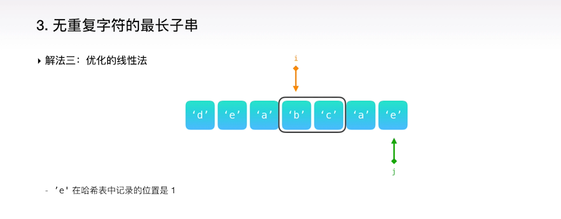

这节课主要介绍的解题方法是：
- 线性法及优化线性法
- 切分法
- 快速选择算法
- 最小堆法
- 分治法

## 例题分析一  
LeetCode 第 03 题：给定一个字符串，请你找出其中不含有重复字符的最长子串的长度。  
### 线性法  
例题 1：给定的字符串里有一段是没有重复字符的，如下，能不能把下一个字符 a 加进来？  
要看当前的子串”abc”是否已经包含了字符 a。  
- 扫描一遍“abc”，当发现某个字符与 a 相同，可以得出结论。
- 把“abc“三个字符放入到一个哈希集合里，那么就能在 O(1) 的时间里作出判断，提高速度。

使用定义一个哈希集合 set 的方法，从给定字符串的头开始，每次检查一下当前字符是不是在集合里边，如果不在，说明这个字符不会造成重复和冲突，把它加入到集合里，并统计一下当前集合的长度，可能它就是最长的那个子串。

例题 2：如果发现新的字符已经在集合里已经出现了，怎么办？

deabc 是目前为止没有重复字符的最长子串，当我们遇到下一个字符a的时候，以这个字符结尾的没有重复的子串是“bca”，而此时集合里的字符有：d，e，a，b，c。首先，必须把 a 删除，因为这样才能把新的 a 加入到集合里，那么如何判断要把 d 和 e 也都删除呢？
 
1. 可以定义两个指针 i 和 j。
2. i 是慢指针，j 是快指针，当 j 遇到了一个重复出现的字符时，从慢指针开始一个一个地将 i 指针指向的字符从集合里删除，然后判断一下是否可以把新字符加入到集合里而不会产生重复。
3. 把字符 d 删除后，i 指针向前移动一步，此时集合里还剩下：e, a, b, c，很明显，字符 a 还在集合里，仍然要继续删除。
4. 把字符 e 删除后，集合里还剩 a，b，c，字符 a 还在集合里，继续删除慢指针 i 指向的字符 a。
5. 集合里剩 b，c，可以放心地把新的字符 a 放入到集合里，然后快指针 j 往前移动一步

通过这样不断尝试，每当新的字符加入到集合里的时候，统计一下当前集合里的元素个数，最后记录下最长的那个。  

**时间复杂度**  
由于采用的是快慢指针的策略，字符串最多被遍历两次，快指针遇到的字符会被添加到哈希集合，而慢指针遇到的字符会从哈希集合里删除，对哈希集合的操作都是 O(1) 的时间复杂度，因此，整个算法的时间复杂度就是 n×O(1) + n×O(1) = O(n)。  

**空间复杂度**  
由于用到了一个哈希集合，在最坏的情况下，给定的字符串没有任何重复的字符，需要把每个字符都加入到哈希集合里，因此空间复杂度是 O(n)。  

**代码实现**
```java

// 定义一个哈希集合 set，初始化结果 max 为 0
int lengthOfLongestSubstring(String s) {
    Set<Character> set = new HashSet<>();
    int max = 0;

    // 用快慢指针 i 和 j 扫描一遍字符串，如果快指针所指向的字符已经出现在哈希集合里，不断地尝试将慢指针所指向的字符从哈希集合里删除
    for (int i = 0, j = 0; j < s.length(); j++) {
        while (set.contains(s.charAt(j))) {
            set.remove(s.charAt(i));
            i++;
        }
        
        // 当快指针的字符加入到哈希集合后，更新一下结果 max
        set.add(s.charAt(j));
        max = Math.max(max, set.size());
    }
    return max;
}
```
### 优化的线性法
在上述例题中，能否让慢指针不再一步一步地挪动，而是迅速地跳到字符 b 的位置？  
可以用哈希表来记录每个字符以及它出现的位置，当遇到了字符 a 的时候，就知道跟它重复的前一个字符出现的位置，只需要让慢指针指向那个位置的下一个即可。（如果题目说所有字符都是字母的话，也可以用一个数组去记录。）  
遇到字符 a，此时哈希表的记录 {d: 0, e: 1, a: 2, b: 3: c: 4}，a 的位置是 2，把 2 加上 1 等于 3，就能让慢指针 i 指向下标为 3 的位置，即 b 字符的地方。 
 
注意：在运用这个算法的时候，不能去数哈希集合的元素个数来作为子串的长度，所以得额外维护一个变量来保存最后的结果。

但是在一些情况下，我们不能简单地将取出来的重复位置加 1，如下：快指针 j 指向的字符是 e，而 e 在哈希表里记录的位置是 1。

在这种情况下，没有必要让 i 重新指向 e 后面的 a。此时，i 应该保留在原地不动。因此，i 被移动到的新位置应该等于 max(i，重复字符出现位置 + 1）。  
**代码实现**  
```java
// 定义一个哈希表用来记录上一次某个字符出现的位置，并初始化结果 max 为 0
int lengthOfLongestSubstring(String s) {
    Map<Character, Integer> map = new HashMap<>();
    int max = 0;

    // 用快慢指针 i 和 j 扫描一遍字符串，若快指针所对应的字符已经出现过，则慢指针跳跃
    for (int i = 0, j = 0; j < s.length(); j++) {
        if (map.containsKey(s.charAt(j))) {
            i = Math.max(i, map.get(s.charAt(j)) + 1);
        }
        
        map.put(s.charAt(j), j);
        max = Math.max(max, j - i + 1);
    }
    
    return max;
}
```

## 例题分析二
LeetCode 第 04 题：给定两个大小为 m 和 n 的有序数组 nums1 和 nums2。请你找出这两个有序数组的中位数，并且要求算法的时间复杂度为 O(log(m+n))。你可以假设 nums1 和 nums2 不会同时为空。
